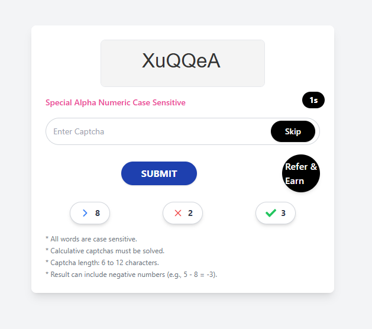

CAPTCHA Solver with Coin Reward System
This is a MERN stack application where users can solve CAPTCHAs and earn coins for each correct solution..

Features
CAPTCHA Solver: Displays CAPTCHA  to users for solving.
Coin Reward System: Updates the user’s coin balance upon correct answers.
Dynamic CAPTCHAs: New CAPTCHA is generated after each submission.

Screenshot

Tech Stack
Frontend
React.js: For building the user interface.
Axios: For making API requests.

Backend
Node.js: Server-side runtime.
Express.js: For handling backend routes and logic.

Installation
Prerequisites
Node.js and npm installed.

1. Clone the repository:
bash
Copy code
git clone https://github.com/visak14/captcha.git
cd captch
2. Install dependencies:
3. 
Backend:
bash
Copy code
cd mcd
npm install

Frontend:
bash
Copy code
cd ../frontend
npm install

4. Run the app:
   
Backend:
cd mcd
npm start
nodemon server.js

Frontend:
cd frontend
npm run dev
